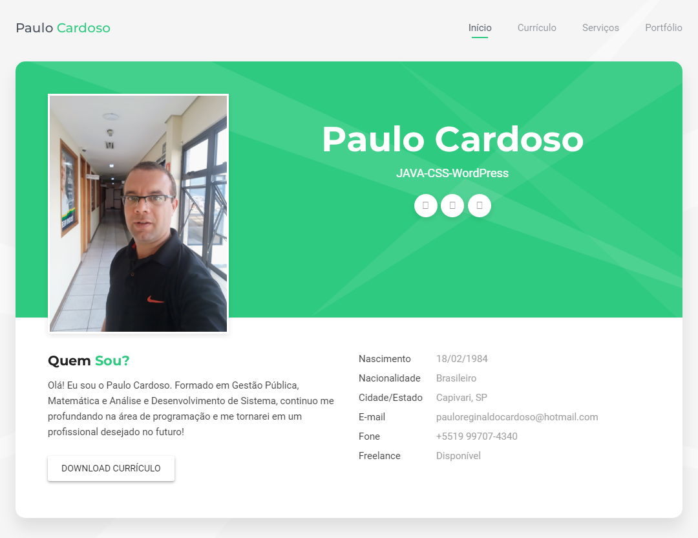

## Nome do seu projeto

> Um resumo curto sobre o que o seu projeto faz

Um ou dois pprágrafos sobre seu projeto e o que ele faz.




### Instalação

Sistemas operacionais

OS X Linus:

```sh
npm instal --save
```

Windows:
```sh
edit autoexec.bat
```

### Exemplo de uso
Alguns exemplos que motivariam as pessoas a utilizarem seu projeto ou que demonstrasse que este é util para alguma coisa ou função. 
Divida essa parte em partes menores e se poss´vel coloque algum código ou prints de telas.

### Ambiente de Desenvolvimento
Descrever como instalar e preparar qualquer dependência de desenvolvimento para que seu projeto possa ser executado localmente e possoas possam contribuir com o mesmo.
Se possivel forneça  as informações para diferentes plataformas, exemplo Windows, Linux e Mac OS.#

### Histórico de Atualizações

* 0.2.1
    * CHANGE: Atualição dos doc (o código não foi alterado)
* 0.2.0
    * CHANGE: Removida a função `setPadrãoXYZ()`
    * ADD: Adicionado a função `inicializar()`
* 0.1.1
    * FIX: Crash quando executava `escrever` (Obrigado ao @Contribuidor)
* 0.1.0
    * O primeiro lançamento estável]
    * CHANGE: Remoeado de `Projeto XYZ` para o `Projeto ABC`
* 0.0.1
    * Projeto inicial

### Meta
Se nome - [@SeuTwitwer](https://twittwe.com/seuTwittwee) - seuemail@gmail.com

Distribuido sobre a licença. Veja `LICENÇA` para mais informações.
[https://github.com/seuusuario/seuprojeto](https://github.com/usuário)

